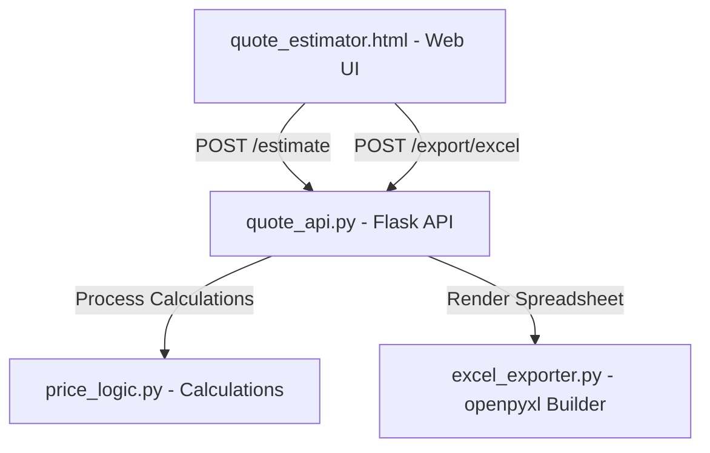

# Landscape & Plant Maintenance Quote Estimation Automation

A premium, high-fidelity real-time pricing and estimation system tailored for **Italian Planters** business operations. It automates quote generation for **AMC (Annual Maintenance Contracts) Sites** and **Project Sites** (both Indoor and Outdoor works), ensuring real-time calculation and instant exports to styled multi-sheet Excel workbooks matching the legacy corporate formats.

---

## 🚀 Key Features

*   **Real-time Cost Projections**: Dynamic, debounced cost calculations as parameters (FTE, palm trees, groundcover, discount thresholds) are adjusted.
*   **Dual Stream System**: Built-in pricing logic splits for:
    *   **AMC Sites** (Outdoor/Indoor Landscaping Maintenance with multi-year escalation and FTE calculations).
    *   **Project Sites** (Indoor/Outdoor Supply & Install works with custom Overhead, Profit, and negotiation margins).
*   **High-Fidelity Excel Export**: Real-time generation of styled, multi-sheet workbooks (`.xlsx`) matching the color, typography, borders, and layouts of your reference files using `openpyxl`.
*   **Modern Interactive Web UI**: Fully responsive, dark-mode dashboard styled with CSS variables, smooth gradients, micro-animations, and immediate error validation.

---

## 🛠️ Architecture & Tech Stack

The system is split into a lightweight, decoupled frontend interface and a high-performance Python computational core:



### Stack Components:
1.  **Frontend**: HTML5, Vanilla JavaScript (fetch API, event listeners, live debounces), CSS3 variables (Inter & Space Grotesk fonts).
2.  **API Backend**: Python, Flask, Flask-CORS (Cross-Origin Resource Sharing).
3.  **Pricing Engine**: Pure Python standard library logic for ultra-fast performance.
4.  **Export Engine**: `openpyxl` for layout mapping, typography fonts, fill colors, and sheet routing.

---

## 📂 Project Directory Structure

```
CostAutomation/
├── quote_estimator.html   # Main web interface (UI)
├── quote_api.py           # Flask REST API server exposing calculation & export routes
├── price_logic.py         # Computational engine (FTE, margins, year-on-year escalations)
├── excel_exporter.py      # Workbook generation module with cell styles & sheets
├── README.md              # Installation & setup documentation
└── Estimation/            # Directory containing reference excel sheets
```

---

## 💻 Installation & Setup

Ensure you have **Python 3.8+** installed on your Windows machine.

### 1. Clone or Open the Directory
Open your terminal (Command Prompt, PowerShell, or Git Bash) in the project workspace folder:
```powershell
cd d:\Dhaniyal\CostAutomation
```

### 2. Install Dependencies
Install the required packages using `pip`:
```powershell
pip install flask flask-cors openpyxl requests
```

---

## 🏃 How to Run the Application

### Step 1: Start the Backend API Server
Launch the Flask backend server from the workspace root:
```powershell
python quote_api.py
```
*You should see:*
```
Quote Estimation API running -> http://localhost:5050
 * Serving Flask app 'quote_api'
 * Running on http://127.0.0.1:5050
```
Keep this terminal window open so the API server continues running in the background.

### Step 2: Open the Web UI
1. Locate the `quote_estimator.html` file in your file explorer.
2. Double-click the file to open it in your web browser (Chrome, Edge, or Firefox).
3. The page will display **Engine online** in the top-right corner to indicate a successful connection to the Python backend.

---

## 💡 How to Generate and Export Quotes

1.  **Select Job Type**: Choose the type of contract from the top tab selector:
    *   **Outdoor AMC**: Maintenance contract with calculations based on trees, shrubs, lawn, and floral rotations.
    *   **Indoor AMC**: Monthly plant rentals/servicing with a dynamic items table.
    *   **Project — Outdoor**: Landscaping construction BOQ with overhead and plant/materials markups.
    *   **Project — Indoor**: Indoor potted plant installations with individual pot and soil calculations.
2.  **Enter Location & Client**: Fill out the *Site / Location Name* and *Client / Company Name* fields.
3.  **Adjust Quantities**: Change values, add lines, or customize commercial settings (e.g., Margin %, Overhead %, Discount values).
4.  **Generate Quote**: Click **⚡ Generate Estimate** to process the values. The breakdown, contract values, and year-on-year totals will display instantly.
5.  **Export to Excel**: Click the **📥 Export Excel** button to download a fully formatted spreadsheet matching the legacy structure.

---

## 📊 Logic Matrix Summary

| Category | Key Variables | Output Metrics | Escalations / Formulas |
|---|---|---|---|
| **Outdoor AMC** | Palms, Trees, Shrubs, Lawn, Flowers, Overhead % | Total FTE, Direct Labor, Equipment, Material Costs | +5% Labor escalation for Year 3 |
| **Indoor AMC** | Quantities, Unit Rates, Monthly Discount | Base Monthly, Net Annual, Monthly VAT 5% | Flat items listing with VAT |
| **Project Outdoor**| Cost, Labor, Supervision, Plant, OH % | Material Subtotal, Base, VAT 5%, Final Quote | Grouped BOQ pricing with margin |
| **Project Indoor** | Pot, Main Plant, Under-plants, Soil+Hydro | Pot subtotal, Plant subtotal, Profit/Nego margins | 20% Overhead + 20% Profit markup structure |
